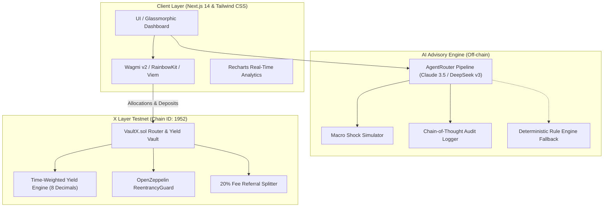

Markdown
# VaultX AI - Autonomous RWA Yield Aggregator & Predictive Smart Money Agent

[-00DC82?style=flat&logo=ethereum)](https://www.okx.com/xlayer)
[](https://www.okx.com/web3/explorer/xlayer-test)
[](https://agentrouter.org)
[](https://vault-x-ai.vercel.app/)

> **VaultX AI** is an autonomous, non-custodial multi-asset yield aggregator and smart money analytics protocol built natively on **X Layer**. It integrates a user-in-the-loop AI advisory engine with onchain capital routing across tokenized Real-World Assets (US Treasuries, Commercial Real Estate, and Private Credit).

---

##  Executive Summary

Tokenized Real-World Assets (RWAs) represent one of the fastest-growing sectors in Web3, yet retail capital remains largely excluded from dynamic risk-adjusted returns due to:
1. **Fragmented Yield Landscapes:** Disparate pools with shifting liquidity and opaque risk profiles.
2. **Static Portfolio Allocation:** Inability to respond dynamically to macroeconomic shocks (e.g., interest rate pivots).
3. **Information Asymmetry:** Smart money and institutional whale flows operate invisibly to retail participants.

**VaultX AI solves this** by pairing real-time onchain execution with an adaptive multi-LLM reasoning engine (powered by AgentRouter) that evaluates risk profiles, tracks whale flows, and executes non-custodial rebalancing natively on X Layer.

---

##  Key Protocol Features

### 1. User-in-the-Loop AI Strategy Engine
* Evaluates dynamic yield spreads across tokenized RWA debt pools (`xT-Bill`, `xRE-1`, `xPCA`).
* Accepts customizable risk preferences (`Low`, `Balanced`, `Aggressive`) and macro shock simulations.
* Routes queries via **AgentRouter** across frontier reasoning models (Claude 3.5 Sonnet / DeepSeek v3) with a local deterministic fallback engine to guarantee 100% uptime.
* **Explainable AI:** Features an interactive **Decision Audit Trail** breaking down telemetry ingestion, factor weights, and risk modeling.

### 2. Real-Time Compounding Yield Engine (8-Decimal Precision)
* Vault positions accrual is computed down to the second onchain using continuous time-weighted compounding formulas.
* UI reflects per-second micro-yield accretion with zero RPC latency.

### 3. Smart Money Analytics & Predictive Liquidity Indexer
* Tracks 24-hour institutional liquidity flows and whale allocation movements.
* Provides predictive confidence scoring and real-time alerts on pool rebalances.
* Includes a **30-Day Historical Alpha Backtest** modeling dynamic AI allocation vs. static baseline holding (+14.4% net alpha).

### 4. Auto-Rebalance Agent Bot
* User-activated autonomous bot that monitors liquidity drift and automatically triggers AI re-evaluations when market imbalances exceed tolerance thresholds.

### 5. Onchain Viral Growth & Referral Economics
* Direct smart contract mapping that routes **20% of protocol fees** to the referring address in perpetuity.

---

## Technical Architecture

## 🛡️ Technical Architecture



### Smart Contract Architecture Note
`VaultX.sol` serves as the **Vault Accounting & Strategy Router Layer**. It decouples user balances and time-weighted yield accrual from underlying asset contracts. In production, strategy allocation calls route through low-level `call()` interfaces directly to target ERC-20 RWA Vault addresses (e.g., Ondo, BlackRock BUIDL wrappers) on X Layer Mainnet via the OKX DEX Router interface.

---

## Supported Tokenized RWA Pools

| Pool Identifier | Asset Class | Base APY | Risk Profile | Target Allocation Strategy |
| :--- | :--- | :---: | :---: | :--- |
| **US Treasury Short-Term Bill (`xT-Bill`)** | Sovereign Debt | `5.1%` | Low | Capital preservation & baseline liquid reserve |
| **Tokenized Real Estate Yield (`xRE-1`)** | Commercial Property | `9.4%` | Medium | Stable cash flow with rental income distribution |
| **Private Credit Pool Alpha (`xPCA`)** | Corporate Senior Debt | `12.8%` | High | High-yield aggressive alpha capture |

---

## Deployed Contract Information

* **Network:** X Layer Testnet
* **Chain ID:** `1952`
* **RPC Endpoint:** `https://testrpc.xlayer.tech`
* **Contract Name:** `VaultX`
* **Contract Address:** `0xf1A7651070f914876253Cb7b24588Be29878F583`
* **Explorer Link:** [View on OKX X Layer Explorer](https://www.okx.com/web3/explorer/xlayer-test/address/0xb730fF07127e77aB41639d6b9ea4b47B57608149)

---

## 🛠️ Local Development & Setup

### Prerequisites
* **Node.js:** `v18.17.0+`
* **Package Manager:** `pnpm` / `npm` / `yarn`
* **Wallet:** MetaMask or OKX Web3 Wallet configured for X Layer Testnet

### 1. Clone Repository
```Bash
  git clone [https://github.com/Ricks0ne/VaultX-AI.git](https://github.com/Ricks0ne/VaultX-AI.git)
  cd VaultX-AI
```

2. Install Dependencies
```Bash
  npm install
```

3. Configure Environment Variables
Create a .env.local file in the root directory:

```Code snippet
AGENTROUTER_API_KEY=your_agentrouter_api_key_here
NEXT_PUBLIC_VAULT_ADDRESS=0xb730fF07127e77aB41639d6b9ea4b47B57608149
```
4. Run Development Server
```Bash
npm run dev
```
Open http://localhost:3000 in your browser.

Roadmap & Mainnet Vision

[x] Phase 1: Testnet MVP Deployment - Deploy VaultX.sol on X Layer Testnet, integrate AgentRouter AI engine, and launch real-time analytics dashboard.

[ ] Phase 2: OKX DEX Aggregator Integration - Direct swap routing for instant cross-token entry into RWA vaults, qualifying for the OKX DEX Launch Grant.

[ ] Phase 3: Formal Verification & Audit - Comprehensive smart contract audits with top Web3 security firms.

[ ] Phase 4: Mainnet Launch & Real ERC-20 RWA Vault Adapters - Partner with live tokenized RWA issuers on X Layer Mainnet.

License
This project is licensed under the MIT License - see the LICENSE file for details.
